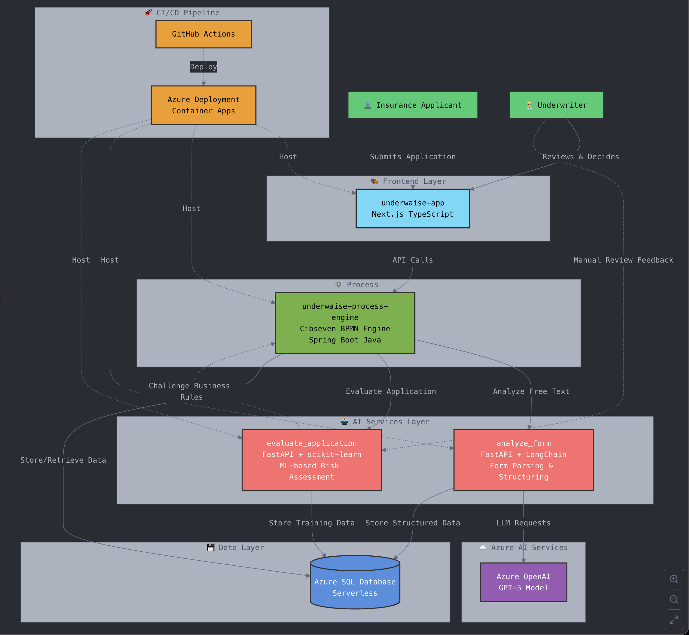
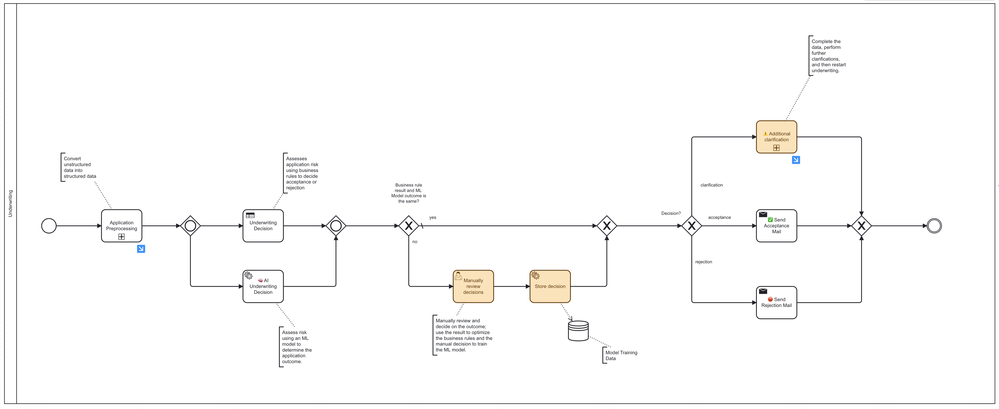
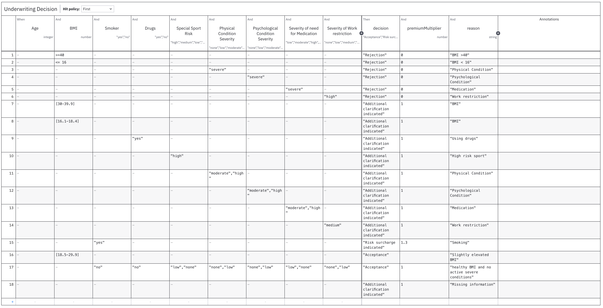
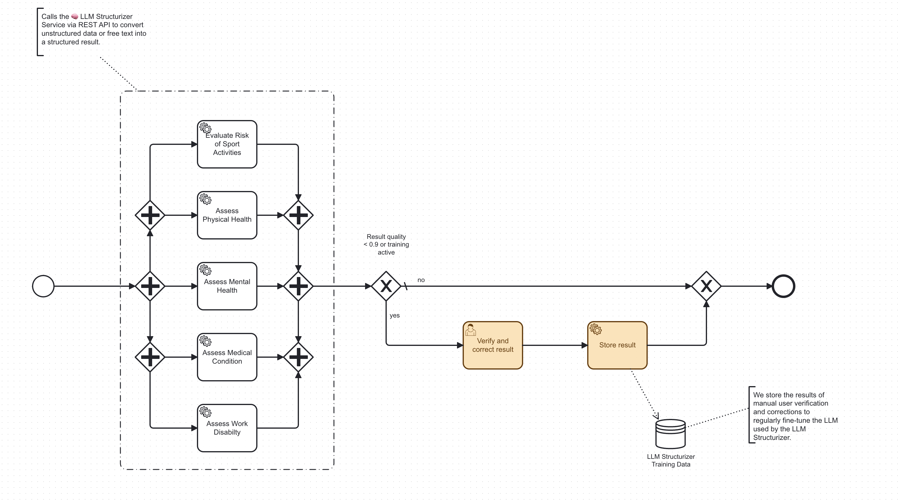
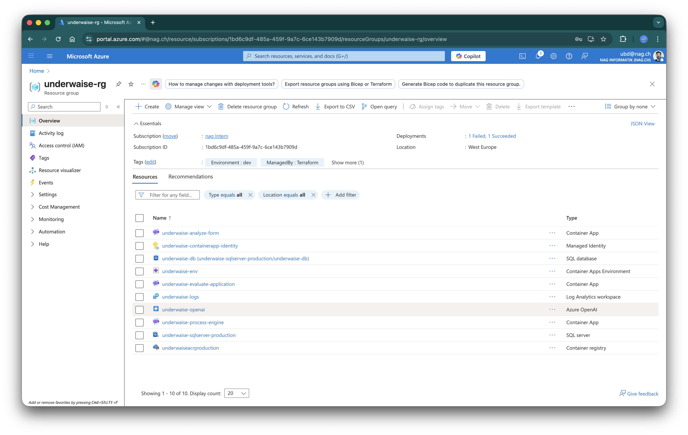
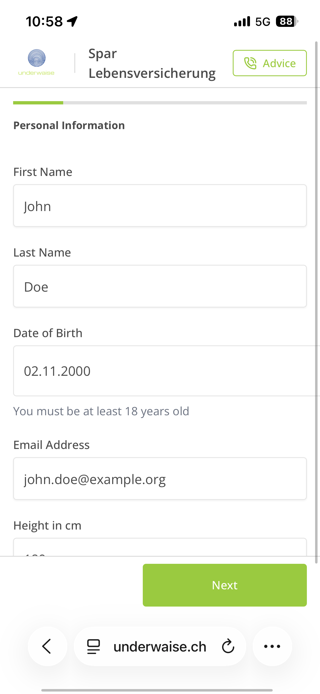
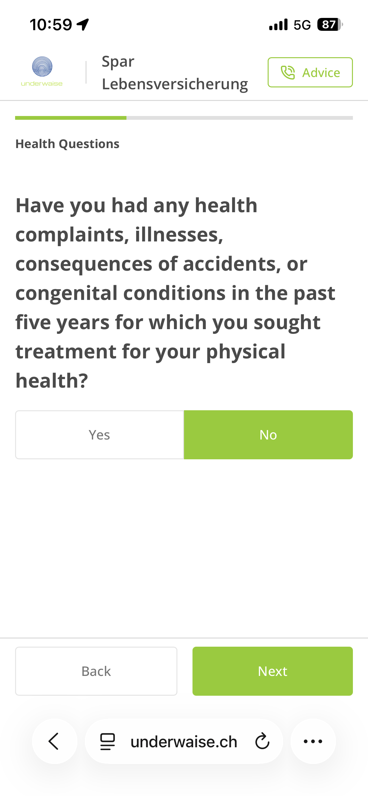
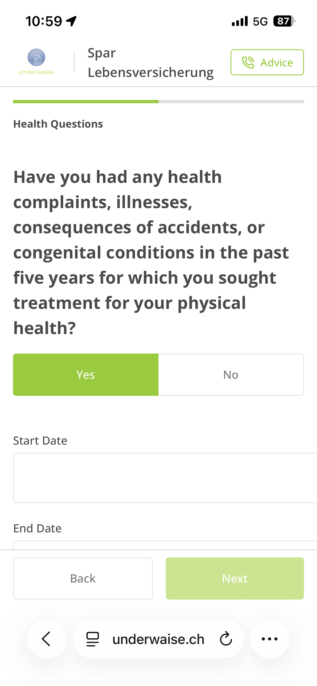
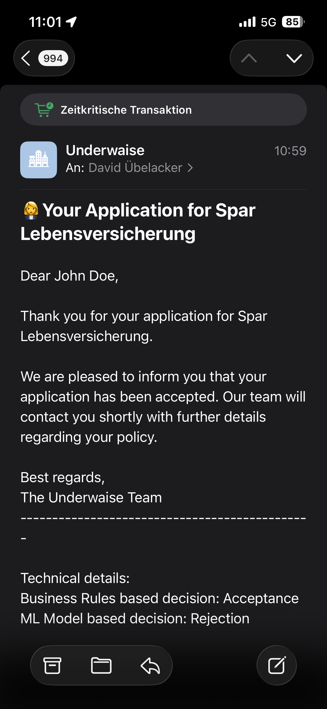
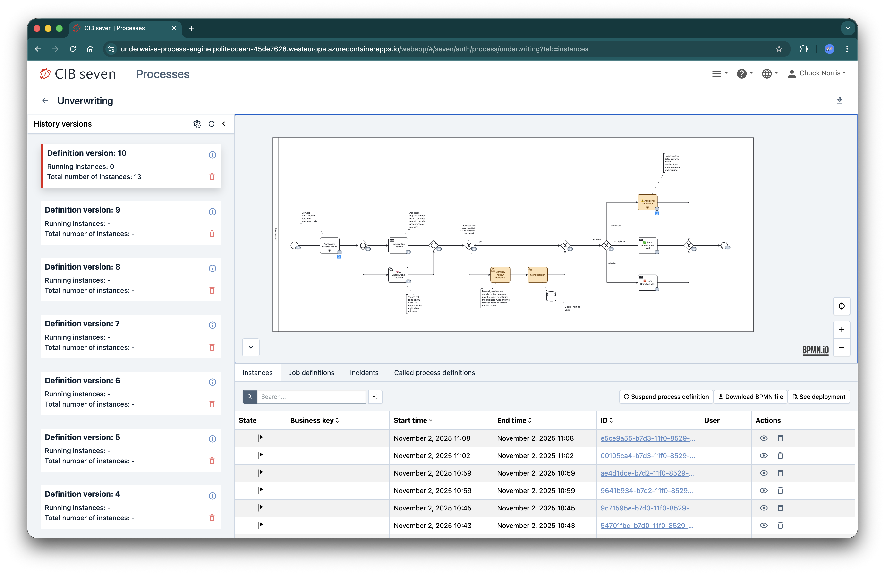

# Documentation

This folder contains documentation images and diagrams for the Underwaise project.

## Architecture Diagrams

### High-Level Overview

*Overall system architecture and component relationships*

### AI Flow

*High-level flow diagram showing AI processing pipeline*

## Process Diagrams

### Underwriting Process

*Main underwriting workflow and decision flow*

### Business Rules

*Business rules and logic for underwriting decisions*

### Application Preprocessing

*Subprocess for preprocessing applications before underwriting*

## Deployment

### Azure Deployment

*Azure cloud infrastructure and deployment architecture*

## Application Screenshots

### User Interface Flow
1. **Landing Page**
   
   *Initial landing page*

2. **Form Step 1**
   
   *First step of the application form*

3. **Form Step 2**
   
   *Second step of the application form*

4. **Form Step 3**
   
   *Third step of the application form*

5. **Form Step 4**
   
   *Final step of the application form*

6. **Result Email**
   
   *Email notification with results*

### Process Engine

*Camunda BPMN process engine cockpit view*

## Additional Files

- `FinalPresentation.pptx` - Final project presentation
- `Unbenanntes Diagramm.drawio` - Draw.io diagram source file
